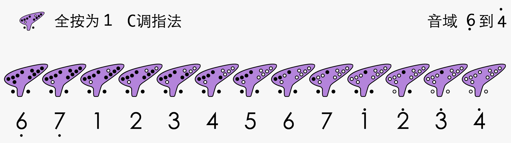

# 🎵 Ocarinana - 陶笛谱生成器

<div align="center">
  
  
  <p><strong>在线数字简谱与陶笛指法谱生成器</strong></p>
  <p>快速编排、实时预览、一键导出</p>

  [](https://nextjs.org/)
  [](https://reactjs.org/)
  [](https://supabase.com/)
  [](https://www.typescriptlang.org/)
  [](./LICENSE)
</div>

---

## ✨ 功能特性

### 核心功能
- 🎼 **数字简谱生成** - 所见即所得的乐谱编辑器
- 🎹 **陶笛指法联动** - 自动根据调号显示指法图（支持 C/F/G 调）
- 📝 **歌词编辑** - 支持中英文歌词智能对齐
- 💾 **自动保存** - 本地存储 + 云端同步
- 🖼️ **图片导出** - 高质量 PNG 导出，适合打印分享
- ↩️ **撤销/恢复** - 支持最多 50 步历史记录
- 🎨 **多种皮肤** - 白色、米色、蓝色主题切换
- 🌓 **暗黑模式** - 全局暗黑模式支持

### 技术特性
- ⚡ 使用 Next.js 15 + React 19 构建
- 🔒 Supabase 认证和数据库
- 🎨 Tailwind CSS + shadcn/ui 组件库
- 📱 完全响应式设计
- 🔐 行级安全策略（RLS）

---

## 🚀 快速开始

### 前置要求

- Node.js 20.x 或更高版本
- npm / yarn / pnpm
- Supabase 账号（[免费注册](https://supabase.com/dashboard)）

### 1. 克隆项目

```bash
git clone <your-repo-url>
cd with-supabase-app
```

### 2. 安装依赖

```bash
npm install
# 或
yarn install
# 或
pnpm install
```

### 3. 配置环境变量

创建 `.env.local` 文件（复制 `.env.example`）：

```bash
cp .env.example .env.local
```

编辑 `.env.local` 并填入你的 Supabase 配置：

```env
NEXT_PUBLIC_SUPABASE_URL=your-project-url.supabase.co
NEXT_PUBLIC_SUPABASE_ANON_KEY=your-anon-key
```

> 💡 在 [Supabase Dashboard](https://supabase.com/dashboard/project/_/settings/api) 获取 URL 和 Key

### 4. 设置数据库

在 Supabase Dashboard 中运行迁移脚本：

1. 进入 SQL Editor
2. 复制 `supabase/migrations/0001_create_scores.sql` 的内容
3. 执行 SQL

或使用 Supabase CLI：

```bash
npx supabase db push
```

### 5. 启动开发服务器

```bash
npm run dev
```

打开 [http://localhost:3000](http://localhost:3000) 查看应用。

---

## 📁 项目结构

```
with-supabase-app/
├── app/                      # Next.js App Router
│   ├── api/                  # API 路由
│   │   └── scores/           # 乐谱 CRUD API
│   ├── auth/                 # 认证页面
│   ├── protected/            # 需要登录的页面
│   │   └── scores/           # 乐谱编辑器
│   ├── layout.tsx            # 根布局
│   └── page.tsx              # 首页
├── components/               # React 组件
│   ├── ui/                   # shadcn/ui 组件
│   ├── scores-bridge.tsx     # iframe 通信桥接
│   └── ...
├── lib/                      # 工具函数
│   ├── supabase/             # Supabase 客户端
│   └── utils.ts              # 通用工具
├── public/                   # 静态资源
│   └── webfile/              # 乐谱编辑器（原生 JS）
│       ├── index.html        # 编辑器页面
│       ├── script.js         # 核心逻辑
│       ├── styles.css        # 样式
│       └── static/           # 指法图资源
├── supabase/                 # Supabase 配置
│   └── migrations/           # 数据库迁移
└── docs/                     # 项目文档
```

---

## 🎯 使用指南

### 创建乐谱

1. 注册/登录账号
2. 点击"立即开始"按钮
3. 在编辑器中：
   - 左侧面板选择音符、时值、休止符
   - 点击编辑区域添加元素
   - 使用顶部工具栏调整调号、拍号
   - 点击"显示指法图"查看陶笛指法

### 导出乐谱

1. 点击顶部"导出图片"按钮
2. 图片会自动下载到本地
3. 支持高分辨率打印

### 键盘快捷键

- `Ctrl/Cmd + Z` - 撤销
- `Ctrl/Cmd + Shift + Z` - 恢复
- `1-7` - 快速输入音符
- `Backspace` - 删除选中元素

---

## 🛠️ 开发指南

### 可用脚本

```bash
# 开发模式（使用 Turbopack）
npm run dev

# 构建生产版本
npm run build

# 启动生产服务器
npm run start

# 代码检查
npm run lint
```

### 技术栈

| 技术 | 版本 | 用途 |
|------|------|------|
| Next.js | 15 | React 框架 |
| React | 19 | UI 库 |
| TypeScript | 5 | 类型安全 |
| Supabase | Latest | 后端服务 |
| Tailwind CSS | 3 | 样式框架 |
| shadcn/ui | Latest | 组件库 |
| html2canvas | 1.4.1 | 图片导出 |

### 添加新的 shadcn/ui 组件

```bash
npx shadcn@latest add [component-name]
```

---

## 📚 文档

- [部署指南](./docs/DEPLOYMENT.md) - 生产环境部署步骤
- [开发指南](./docs/DEVELOPMENT.md) - 详细的开发文档
- [API 文档](./docs/API.md) - API 接口说明
- [商业化评估](./BUSINESS_READINESS_ASSESSMENT.md) - 商业化成熟度分析
- [实施路线图](./IMPLEMENTATION_ROADMAP.md) - 功能开发计划

---

## 🚢 部署

### Vercel（推荐）

[](https://vercel.com/new/clone?repository-url=<your-repo-url>)

1. 点击上方按钮
2. 连接你的 GitHub 仓库
3. 配置环境变量
4. 部署！

详细步骤见 [部署文档](./docs/DEPLOYMENT.md)。

### 其他平台

- Netlify
- Railway
- 自托管服务器

---

## 🤝 贡献

欢迎贡献！请遵循以下步骤：

1. Fork 本仓库
2. 创建特性分支 (`git checkout -b feature/AmazingFeature`)
3. 提交更改 (`git commit -m 'Add some AmazingFeature'`)
4. 推送到分支 (`git push origin feature/AmazingFeature`)
5. 开启 Pull Request

### 开发规范

- 使用 TypeScript
- 遵循 ESLint 规则
- 提交前运行 `npm run lint`
- 编写清晰的 commit message

---

## 📝 许可证

本项目基于 MIT 许可证开源 - 查看 [LICENSE](./LICENSE) 文件了解详情。

---

## 🙏 致谢

- [Next.js](https://nextjs.org/) - React 框架
- [Supabase](https://supabase.com/) - 开源 Firebase 替代品
- [shadcn/ui](https://ui.shadcn.com/) - 美观的组件库
- [Tailwind CSS](https://tailwindcss.com/) - CSS 框架
- [Vercel](https://vercel.com/) - 托管平台

---

## 📧 联系方式

- 项目主页: [https://ocarinana.com](https://ocarinana.com)
- 问题反馈: [GitHub Issues](https://github.com/your-username/ocarinana/issues)
- 邮箱: support@ocarinana.com

---

## 🗺️ 路线图

### v1.0 (当前)
- [x] 基础简谱编辑功能
- [x] 陶笛指法图显示
- [x] 用户认证系统
- [x] 云端同步

### v1.1 (计划中)
- [ ] PDF 导出
- [ ] MIDI 播放
- [ ] 移动端优化
- [ ] 社交分享

### v2.0 (未来)
- [ ] 多人协作编辑
- [ ] 曲库分享平台
- [ ] 更多乐器支持
- [ ] AI 作曲辅助

---

<div align="center">
  <p>用 ❤️ 打造 by Ocarinana Team</p>
  <p>© 2025 Ocarinana. All rights reserved.</p>
</div>
